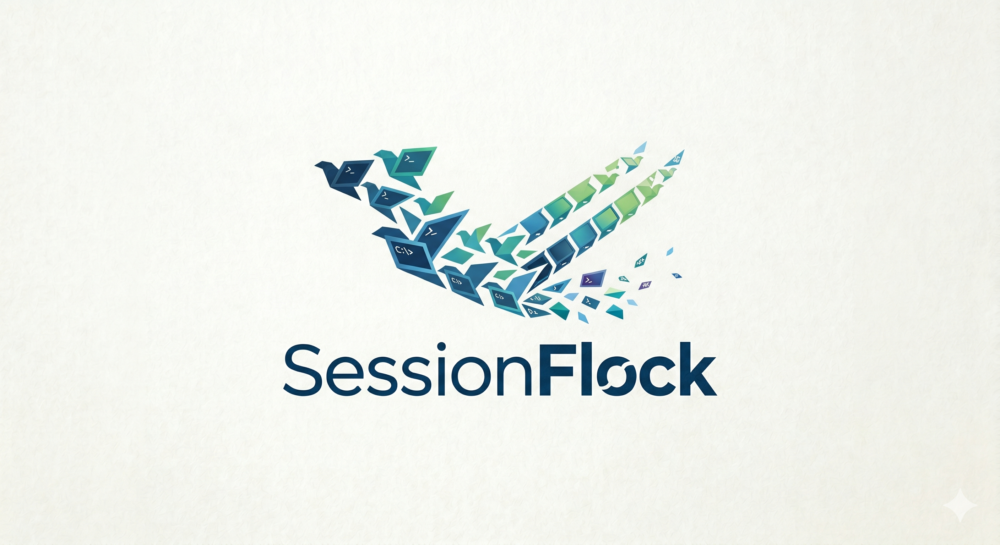

<p align="center">
  
</p>

<p align="center">
  <b>A desktop workspace for running many terminal AI-agent sessions at once —
  each in its own embedded terminal tab.</b><br/>
  Agent-agnostic by design, with <b>Claude Code</b> supported out of the box.
</p>

## Why

If you run several terminal agents in parallel, it's hard to track which session is
which, jump back into the right one, and run several at once without their changes
colliding. Sessionflock gives each session its own tab, tells you when one needs you,
and (planned) isolates each in its own git worktree.

## Features

- **Multi-terminal workspace** — sessions as tabs down the left; click to focus and
  interact with the agent in a real embedded terminal (xterm.js + node-pty).
- **New session** in a configurable default folder.
- **Agent selection** — a setting picks which agent new sessions launch.
- **"Needs you" indicator** — a tab dot when a backgrounded session is waiting for
  you, driven by real signals (the agent's lifecycle hooks / terminal bell), not a timer.
- **Auto tab naming** from the running program, with manual rename.
- **Session persistence** — your open tabs reopen on restart (fresh agent processes).
- **Close with confirmation.**
- **Light / dark / system theme.**

Roadmap (worktree isolation, existing-session browse/resume, ad-hoc folder launch,
usage stats, Windows support, and more) lives in [`agent-os/product/roadmap.md`](agent-os/product/roadmap.md).

## Install

Download the installer for your OS from the [Releases](../../releases) page:

- **Linux:** `.AppImage` (mark executable and run) or `.deb`.
- **macOS:** `.dmg`. The build is currently **unsigned**, so on first launch use
  right-click → Open (or *System Settings → Privacy & Security → Open Anyway*).

You'll also need the agent's CLI installed and on your PATH — for Claude Code, the
`claude` binary (Sessionflock auto-detects it; you can also set its path in Settings).

## Development

Prerequisites: **Node.js 20+** and the `claude` CLI.

```bash
npm install        # installs deps and rebuilds node-pty for Electron
npm run dev        # launch with hot reload
```

Useful env flags:

- `SFLOCK_DEBUG=1` — log agent hook events to the dev console.
- `SFLOCK_DISABLE_GPU=1` — software rendering for headless/container environments.

Other scripts:

```bash
npm run typecheck  # main + renderer
npm run build      # electron-vite production build
npm run package    # build + package installers via electron-builder
```

## Architecture

- **Electron** main process — window, IPC, and the PTY manager (owns every node-pty).
- **React + xterm.js** renderer — the workspace UI and terminals (terminal objects
  live outside React state).
- **Agent adapters** (`src/main/agents/`) — each agent implements how to locate its
  binary, build its launch args/env, and surface "needs you" signals. Claude Code
  ships as an adapter.
- Config/UI state in local JSON (Electron `userData`).

## License

[MIT](LICENSE) © 2026 Jens Heidarsson
